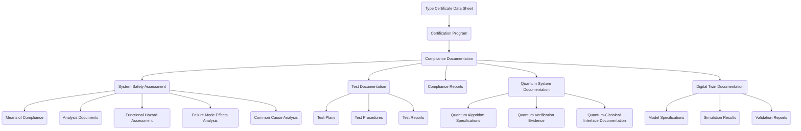

# AI-Driven Document Management System (DMS) Integration for Ampel360 BWB Q100 Certification

**Document ID:** GAIA-QAO-SPEC-DMS-2025-001
**Version:** 0.7
**Status:** DRAFT
**Classification:** INTERNAL
**InfoCode:** GP-QAO-DMS-CERT-001

---

## 1. Introduction

This specification defines the **AI-Driven DMS** integration with the Ampel360 BWB Q100 certification ecosystem. The DMS will serve as the authoritative, audit-traceable repository for all certification artifacts, technical documentation, and compliance evidence—enabling seamless management of the complex, quantum-enhanced documentation chain.

---

## 2. Certification Documentation Requirements

### 2.1 EASA Certification Documentation Hierarchy



---

### 2.2 Document Types and Volumes

| Document Category      | Estimated Volume | Update Frequency | Security Classification |
| ---------------------- | ---------------- | ---------------- | ----------------------- |
| System Specifications  | 500+             | Medium           | Confidential            |
| Engineering Drawings   | 10,000+          | Low              | Confidential            |
| Analysis Reports       | 1,000+           | Medium           | Confidential            |
| Test Documentation     | 5,000+           | High             | Confidential            |
| Compliance Evidence    | 2,000+           | Medium           | Confidential            |
| Quantum Documentation  | 300+             | High             | Restricted              |
| Digital Twin Data      | 50+ TB           | Very High        | Confidential            |
| Software Documentation | 3,000+           | High             | Confidential            |
| Manufacturing Records  | 8,000+           | Medium           | Internal                |
| Operational Manuals    | 200+             | Low              | Public/Internal         |

---

## 3. DMS Integration Architecture

### 3.1 System Integration Overview

```plaintext
[Engineering/PLM/CAD/Simulation/Test Data]
         ↕         ↕          ↕          ↕
 ┌─────────────────────────────────────────────┐
 │         AI-Driven Document Mgmt System      │
 │  ┌─────────────┬─────────────┬─────────────┬─────────────┐
 │  │ Repository  │  Search     │ Compliance  │ Workflow    │
 │  ├─────────────┼─────────────┼─────────────┼─────────────┤
 │  │ Versioning  │  AI Engine  │ Security    │ API Gateway │
 │  └─────────────┴─────────────┴─────────────┴─────────────┘
 └─────────────────────────────────────────────┘
         ↕
 [Engineering, Certification, QA, Mfg, Audit, Authorities]
```

### 3.2 Integration Points

| System           | Integration Method   | Data Flow      | Authentication |
| ---------------- | -------------------- | -------------- | -------------- |
| CAD/CAM          | REST API, File Hooks | Bi-directional | OAuth2/SAML    |
| PLM              | REST API, DB Link    | Bi-directional | OAuth2/SAML    |
| Simulation       | REST API, File Hooks | Bi-directional | OAuth2/SAML    |
| Test Data Mgmt   | REST API, DB Link    | Bi-directional | OAuth2/SAML    |
| Digital Twin     | REST API, WebSockets | Bi-directional | OAuth2/SAML    |
| Quantum Platform | Secure API, mTLS     | Bi-directional | OAuth2/mTLS    |
| EASA Submission  | REST API, SFTP       | Outbound       | OAuth2/mTLS    |

---

## 4. Certification-Specific Features

### 4.1 Compliance Mapping & Traceability

* Automated requirement-document mapping
* Evidence linking to specific CS-25/DO/ARP requirements
* Dynamic gap and change analysis
* Full compliance audit trails

### 4.2 Quantum Documentation Management

* Quantum algorithm/circuit versioning
* Quantum-classical interface records
* Quantum verification evidence storage
* Quantum advantage and mitigation metrics traceability

### 4.3 Digital Twin Integration

* Link digital twin parts to documentation
* Store and version sim results as evidence
* As-built vs as-designed tracking
* Operational data link to maintenance docs

### 4.4 AI-Enhanced Certification Workflows

* Auto classification by certification relevance
* AI-driven compliance and completeness checks
* Intelligent routing to reviewers
* Automated anomaly and gap detection
* Natural language certification queries

---

## 5. Security and Access Control

### 5.1 Role-Based Access

| Role              | Level | Document Types | Actions                  |
| ----------------- | ----- | -------------- | ------------------------ |
| Program Manager   | High  | All            | View/Edit/Approve/Delete |
| Certification Mgr | High  | Cert Docs      | View/Edit/Approve        |
| Engineering Lead  | Med   | Technical Docs | View/Edit/Approve        |
| Engineer          | Med   | Technical Docs | View/Edit                |
| QA                | Med   | All            | View/Comment             |
| Manufacturing     | Low   | Mfg Docs       | View                     |
| Auditor           | Med   | All            | View                     |
| Reg Authority     | Med   | Cert Docs      | View                     |

### 5.2 Security Features

* End-to-end encryption (at rest/in transit)
* MFA for all users
* Hardware security modules (HSM)
* Comprehensive audit logging
* Secure enclaves for quantum docs
* Data loss prevention (DLP)
* Expirable, encrypted external sharing

---

## 6. AI Capabilities for Certification

### 6.1 Document Analysis/Classification

* Metadata extraction
* Automated relevance/certification tagging
* Cross-reference and relationship mapping
* Inconsistency detection
* Terminology normalization

### 6.2 Semantic Search

* Natural language queries
* Aerospace/certification-aware search
* Contextual, faceted, knowledge graph navigation

### 6.3 Automated Compliance Checking

* Requirement coverage analysis
* Completeness/section presence checks
* Regulatory language alignment
* Compliance likelihood prediction
* Evidence gap identification

---

## 7. Implementation Roadmap

| Phase        | Timeline   | Key Deliverables                    |
| ------------ | ---------- | ----------------------------------- |
| Foundation   | Q3–Q4 2025 | Repo, search, system integration    |
| Advanced     | Q1–Q2 2026 | AI, workflow, quantum/digital twin  |
| Optimization | Q3–Q4 2026 | Predictive, natural language, audit |

---

## 8. Certification Benefits

| Area         | Metric                         | Improvement |
| ------------ | ------------------------------ | ----------- |
| Efficiency   | Documentation time             | -40–60%     |
| Efficiency   | Search/review/audit cycles     | -50–80%     |
| Quality      | Error/consistency/completeness | +70–99%     |
| Traceability | Req–evidence link              | 100%        |
| Compliance   | Confidence                     | 95–99%      |

---

## 9. Integration with Quantum Verification Framework

* Store and cross-link quantum verification results
* Link to certification requirement objects
* Version and manage artifacts/evidence
* Auto-generate verification and compliance reports
* Monitor/visualize coverage dynamically

---

## 10. Conclusion

The **AI-Driven DMS** is foundational to Ampel360 BWB Q100 certification: it accelerates auditability, enables quantum compliance, and ensures high-quality, traceable, and federated document management—fulfilling both operational and regulatory imperatives for quantum-class aerospace systems.

---

## 11. References

1. GAIA-QAO-PROC-VALID-2025-005: Neural Network Validation Procedure
2. GAIA-QAO-SPEC-NNINT-2025-001: Neural Network Integration for Quantum-Enhanced Aerospace
3. GAIA-QAO-PLAN-QC-2025-003: Quantum Computing Integration Plan
4. EASA CS-25: Certification Specs for Large Aeroplanes
5. DO-178C: SW Considerations for Airborne Systems
6. ARP4754A: Civil Aircraft Development Guidelines

---

**Status:** DRAFT
**Filename:** `GAIA-QAO-SPEC-DMS-2025-001.md`
**Version:** 0.7
**InfoCode:** GP-QAO-DMS-CERT-001
**Optional Extensions:** \[YAML schema, JSON, S1000D/ATA mappings, AGAD cross-link, semantic API export]

---


