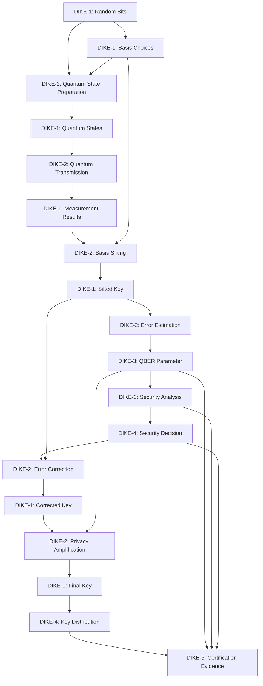

### DIKE Entity Schema for Quantum Key Distribution Systems

---

## GenAI Proposal Status: Disclaimer

This documentation is a GenAI proposal and has **not been reviewed by aviation authorities**.  
It is intended for design exploration and documentation purposes only and should **not be used for certification or operational purposes**.

---

**Document Metadata**

- **Document ID:** `GAIA-QAO-SCHEMA-DIKE-QKD-2025-001`  
- **Version:** `0.4`  
- **Status:** `DRAFT`  
- **Classification:** `RESTRICTED`  
- **InfoCode:** `GP-QAO-DIKE-SCHEMA-001`

## 1. Introduction

This document defines the comprehensive schema for Data Identifiable Knowledge Entities (DIKE) within the Quantum Key Distribution (QKD) system of the Ampel360 BWB Q100 aircraft. The schema establishes standardized structures, relationships, and validation rules for all knowledge entities generated throughout the QKD lifecycle, ensuring complete traceability, auditability, and certification support.

## 2. Schema Overview

### 2.1 Core DIKE Entity Structure

```json
{
  "$schema": "https://gaia-qao.aero/schemas/dike/v1.0/entity.json",
  "title": "DIKE Entity Schema for QKD",
  "type": "object",
  "required": [
    "dike_id",
    "dike_class",
    "entity_type",
    "version",
    "timestamp_created",
    "content",
    "metadata",
    "security"
  ],
  "properties": {
    "dike_id": {
      "type": "string",
      "pattern": "^QKD-[0-9]{8}-[A-Z0-9]{8}-[A-Z]+-[0-9]{3}-[A-Z]+-[0-9]{3}$",
      "description": "Unique identifier for the DIKE entity following the pattern QKD-YYYYMMDD-AIRCRAFTID-SESSIONTYPE-NNN-ENTITYTYPE-NNN"
    },
    "dike_class": {
      "type": "string",
      "enum": ["DIKE-1", "DIKE-2", "DIKE-3", "DIKE-4", "DIKE-5"],
      "description": "Classification level of the DIKE entity"
    },
    "entity_type": {
      "type": "string",
      "enum": [
        "QUANTUM_DATA",
        "PROTOCOL_METADATA",
        "SECURITY_PARAMETER",
        "OPERATIONAL_KNOWLEDGE",
        "CERTIFICATION_EVIDENCE"
      ],
      "description": "Type of knowledge contained in the entity"
    },
    "version": {
      "type": "string",
      "pattern": "^[0-9]+\\.[0-9]+\\.[0-9]+$",
      "description": "Semantic version of the entity (major.minor.patch)"
    },
    "timestamp_created": {
      "type": "string",
      "format": "date-time",
      "description": "ISO 8601 timestamp of entity creation"
    },
    "timestamp_modified": {
      "type": "string",
      "format": "date-time",
      "description": "ISO 8601 timestamp of last entity modification"
    },
    "expiration": {
      "type": "string",
      "format": "date-time",
      "description": "ISO 8601 timestamp of entity expiration (if applicable)"
    },
    "parent_entities": {
      "type": "array",
      "items": {
        "type": "string",
        "pattern": "^QKD-[0-9]{8}-[A-Z0-9]{8}-[A-Z]+-[0-9]{3}-[A-Z]+-[0-9]{3}$"
      },
      "description": "Array of parent DIKE entity IDs"
    },
    "child_entities": {
      "type": "array",
      "items": {
        "type": "string",
        "pattern": "^QKD-[0-9]{8}-[A-Z0-9]{8}-[A-Z]+-[0-9]{3}-[A-Z]+-[0-9]{3}$"
      },
      "description": "Array of child DIKE entity IDs"
    },
    "related_entities": {
      "type": "array",
      "items": {
        "type": "object",
        "properties": {
          "entity_id": {
            "type": "string",
            "pattern": "^QKD-[0-9]{8}-[A-Z0-9]{8}-[A-Z]+-[0-9]{3}-[A-Z]+-[0-9]{3}$"
          },
          "relationship_type": {
            "type": "string",
            "enum": [
              "REFERENCES",
              "DEPENDS_ON",
              "VALIDATES",
              "SUPERSEDES",
              "COMPLEMENTS"
            ]
          }
        },
        "required": ["entity_id", "relationship_type"]
      },
      "description": "Array of related DIKE entities with relationship types"
    },
    "content": {
      "type": "object",
      "description": "The actual knowledge content of the entity (schema varies by entity_type)"
    },
    "content_hash": {
      "type": "string",
      "pattern": "^[a-f0-9]{64}$",
      "description": "SHA-256 hash of the content object for integrity verification"
    },
    "metadata": {
      "type": "object",
      "description": "Metadata describing the entity context and properties"
    },
    "security": {
      "type": "object",
      "description": "Security properties and access control information"
    },
    "certification": {
      "type": "object",
      "description": "Certification-related information"
    },
    "digital_signatures": {
      "type": "object",
      "description": "Cryptographic signatures for entity authentication and integrity"
    }
  }
}
```

### 2.2 Entity Type-Specific Schemas

#### 2.2.1 QUANTUM_DATA (DIKE-1)

```json
{
  "content": {
    "type": "object",
    "required": ["data_type", "quantum_source", "data_format", "data_value"],
    "properties": {
      "data_type": {
        "type": "string",
        "enum": [
          "RANDOM_BITS",
          "BASIS_CHOICES",
          "QUANTUM_STATES",
          "MEASUREMENT_RESULTS",
          "ERROR_STATISTICS"
        ]
      },
      "quantum_source": {
        "type": "string",
        "enum": [
          "QRNG",
          "ENTANGLED_PHOTON_SOURCE",
          "SINGLE_PHOTON_SOURCE",
          "WEAK_COHERENT_SOURCE",
          "MEASUREMENT_DEVICE"
        ]
      },
      "data_format": {
        "type": "string",
        "enum": ["BINARY", "HEX", "BASE64", "DECIMAL", "STATISTICAL"]
      },
      "data_value": {
        "type": "string",
        "description": "The actual data value in the specified format"
      },
      "sample_size": {
        "type": "integer",
        "minimum": 1,
        "description": "Number of bits or samples in the data"
      },
      "timestamp_generated": {
        "type": "string",
        "format": "date-time",
        "description": "Precise timestamp when the quantum data was generated"
      }
    }
  },
  "metadata": {
    "type": "object",
    "required": ["protocol_phase", "hardware_id", "session_id"],
    "properties": {
      "protocol_phase": {
        "type": "string",
        "enum": [
          "INITIALIZATION",
          "QUANTUM_TRANSMISSION",
          "MEASUREMENT",
          "SIFTING",
          "ERROR_ESTIMATION",
          "ERROR_CORRECTION",
          "PRIVACY_AMPLIFICATION",
          "FINAL_KEY_GENERATION"
        ]
      },
      "hardware_id": {
        "type": "string",
        "description": "Identifier of the hardware component that generated the data"
      },
      "session_id": {
        "type": "string",
        "description": "Identifier of the QKD session"
      },
      "environmental_conditions": {
        "type": "object",
        "properties": {
          "temperature": {
            "type": "number",
            "description": "Temperature in degrees Celsius"
          },
          "vibration": {
            "type": "number",
            "description": "Vibration level in g"
          },
          "altitude": {
            "type": "number",
            "description": "Altitude in feet"
          },
          "electromagnetic_interference": {
            "type": "number",
            "description": "EMI level in dB"
          }
        }
      }
    }
  }
}
```

#### 2.2.2 PROTOCOL_METADATA (DIKE-2)

```json
{
  "content": {
    "type": "object",
    "required": ["protocol_name", "protocol_version", "phase", "parameters", "status"],
    "properties": {
      "protocol_name": {
        "type": "string",
        "enum": ["BB84", "E91", "BBM92", "DECOY_STATE_BB84", "TWIN_FIELD_QKD"]
      },
      "protocol_version": {
        "type": "string",
        "description": "Version of the protocol implementation"
      },
      "phase": {
        "type": "string",
        "enum": [
          "INITIALIZATION",
          "QUANTUM_TRANSMISSION",
          "MEASUREMENT",
          "SIFTING",
          "ERROR_ESTIMATION",
          "ERROR_CORRECTION",
          "PRIVACY_AMPLIFICATION",
          "FINAL_KEY_GENERATION"
        ]
      },
      "parameters": {
        "type": "object",
        "description": "Protocol-specific parameters for this phase"
      },
      "status": {
        "type": "string",
        "enum": ["STARTED", "IN_PROGRESS", "COMPLETED", "FAILED", "ABORTED"]
      },
      "start_time": {
        "type": "string",
        "format": "date-time"
      },
      "end_time": {
        "type": "string",
        "format": "date-time"
      },
      "duration_ms": {
        "type": "integer",
        "minimum": 0
      }
    }
  },
  "metadata": {
    "type": "object",
    "required": ["session_id", "participants"],
    "properties": {
      "session_id": {
        "type": "string",
        "description": "Identifier of the QKD session"
      },
      "participants": {
        "type": "array",
        "items": {
          "type": "object",
          "properties": {
            "role": {
              "type": "string",
              "enum": ["ALICE", "BOB", "TRUSTED_NODE", "RELAY"]
            },
            "id": {
              "type": "string",
              "description": "Identifier of the participant"
            },
            "location": {
              "type": "object",
              "properties": {
                "type": {
                  "type": "string",
                  "enum": ["AIRCRAFT", "GROUND_STATION", "SATELLITE"]
                },
                "coordinates": {
                  "type": "object",
                  "properties": {
                    "latitude": { "type": "number" },
                    "longitude": { "type": "number" },
                    "altitude": { "type": "number" }
                  }
                }
              }
            }
          }
        }
      },
      "channel_properties": {
        "type": "object",
        "properties": {
          "channel_type": {
            "type": "string",
            "enum": ["FREE_SPACE_OPTICAL", "FIBER_OPTIC", "SATELLITE_LINK"]
          },
          "channel_loss": {
            "type": "number",
            "description": "Channel loss in dB"
          },
          "distance": {
            "type": "number",
            "description": "Distance in kilometers"
          },
          "wavelength": {
            "type": "number",
            "description": "Wavelength in nm"
          }
        }
      }
    }
  }
}
```

#### 2.2.3 SECURITY_PARAMETER (DIKE-3)

```json
{
  "content": {
    "type": "object",
    "required": ["parameter_type", "parameter_value", "security_threshold", "confidence_level"],
    "properties": {
      "parameter_type": {
        "type": "string",
        "enum": [
          "QUANTUM_BIT_ERROR_RATE",
          "PRIVACY_AMPLIFICATION_FACTOR",
          "SECURITY_PARAMETER_EPSILON",
          "MIN_ENTROPY",
          "EXPECTED_NUMBER_OF_PHOTONS",
          "DECOY_STATE_INTENSITY",
          "PHASE_ERROR_RATE"
        ]
      },
      "parameter_value": {
        "type": "number",
        "description": "Measured or calculated value of the security parameter"
      },
      "security_threshold": {
        "type": "number",
        "description": "Threshold value for security guarantee"
      },
      "confidence_level": {
        "type": "number",
        "minimum": 0,
        "maximum": 1,
        "description": "Statistical confidence level for the parameter"
      },
      "sample_size": {
        "type": "integer",
        "minimum": 1,
        "description": "Number of samples used to calculate the parameter"
      },
      "calculation_method": {
        "type": "string",
        "description": "Method used to calculate the parameter"
      },
      "security_impact": {
        "type": "string",
        "enum": ["CRITICAL", "HIGH", "MEDIUM", "LOW"],
        "description": "Impact of this parameter on overall security"
      }
    }
  },
  "metadata": {
    "type": "object",
    "required": ["protocol_phase", "session_id", "timestamp"],
    "properties": {
      "protocol_phase": {
        "type": "string",
        "enum": [
          "ERROR_ESTIMATION",
          "ERROR_CORRECTION",
          "PRIVACY_AMPLIFICATION",
          "FINAL_KEY_GENERATION"
        ]
      },
      "session_id": {
        "type": "string",
        "description": "Identifier of the QKD session"
      },
      "timestamp": {
        "type": "string",
        "format": "date-time",
        "description": "Timestamp when the parameter was calculated"
      },
      "threat_model_assumptions": {
        "type": "array",
        "items": {
          "type": "string",
          "description": "Assumptions made in the security analysis"
        }
      },
      "security_proofs": {
        "type": "array",
        "items": {
          "type": "object",
          "properties": {
            "proof_id": {
              "type": "string",
              "description": "Identifier of the security proof"
            },
            "proof_reference": {
              "type": "string",
              "description": "Reference to the security proof document"
            }
          }
        }
      }
    }
  }
}
```

#### 2.2.4 OPERATIONAL_KNOWLEDGE (DIKE-4)

```json
{
  "content": {
    "type": "object",
    "required": ["knowledge_type", "operational_context", "knowledge_content"],
    "properties": {
      "knowledge_type": {
        "type": "string",
        "enum": [
          "PROCEDURE",
          "DECISION",
          "OBSERVATION",
          "RECOMMENDATION",
          "PERFORMANCE_METRIC",
          "INCIDENT_RESPONSE"
        ]
      },
      "operational_context": {
        "type": "string",
        "enum": [
          "NORMAL_OPERATION",
          "DEGRADED_MODE",
          "EMERGENCY",
          "MAINTENANCE",
          "TESTING"
        ]
      },
      "knowledge_content": {
        "type": "object",
        "description": "Content depends on knowledge_type"
      },
      "operational_impact": {
        "type": "string",
        "enum": ["CRITICAL", "HIGH", "MEDIUM", "LOW"],
        "description": "Impact of this knowledge on operations"
      },
      "action_required": {
        "type": "boolean",
        "description": "Whether action is required based on this knowledge"
      },
      "action_deadline": {
        "type": "string",
        "format": "date-time",
        "description": "Deadline for required action, if applicable"
      }
    }
  },
  "metadata": {
    "type": "object",
    "required": ["source", "applicable_systems", "lifecycle_stage"],
    "properties": {
      "source": {
        "type": "string",
        "enum": ["AUTOMATED", "HUMAN_OPERATOR", "MAINTENANCE_PERSONNEL", "SECURITY_OFFICER"]
      },
      "applicable_systems": {
        "type": "array",
        "items": {
          "type": "string",
          "description": "Systems to which this knowledge applies"
        }
      },
      "lifecycle_stage": {
        "type": "string",
        "enum": ["DEVELOPMENT", "TESTING", "DEPLOYMENT", "OPERATION", "MAINTENANCE", "RETIREMENT"]
      },
      "operational_conditions": {
        "type": "object",
        "properties": {
          "flight_phase": {
            "type": "string",
            "enum": ["PRE_FLIGHT", "TAKEOFF", "CRUISE", "LANDING", "POST_FLIGHT"]
          },
          "environmental_conditions": {
            "type": "object",
            "properties": {
              "temperature": { "type": "number" },
              "altitude": { "type": "number" },
              "weather": { "type": "string" }
            }
          }
        }
      }
    }
  }
}
```

#### 2.2.5 CERTIFICATION_EVIDENCE (DIKE-5)

```json
{
  "content": {
    "type": "object",
    "required": ["evidence_type", "certification_requirements", "evidence_content", "verification_method"],
    "properties": {
      "evidence_type": {
        "type": "string",
        "enum": [
          "TEST_RESULT",
          "ANALYSIS_RESULT",
          "INSPECTION_RESULT",
          "DEMONSTRATION_RESULT",
          "COMPLIANCE_STATEMENT",
          "SAFETY_ASSESSMENT"
        ]
      },
      "certification_requirements": {
        "type": "array",
        "items": {
          "type": "object",
          "properties": {
            "requirement_id": {
              "type": "string",
              "description": "Identifier of the certification requirement"
            },
            "standard": {
              "type": "string",
              "enum": ["CS-25", "DO-326A", "DO-356A", "DO-178C", "ARP4754A", "NIST-SP-800-57"]
            },
            "section": {
              "type": "string",
              "description": "Section of the standard"
            }
          }
        }
      },
      "evidence_content": {
        "type": "object",
        "description": "Content depends on evidence_type"
      },
      "verification_method": {
        "type": "string",
        "enum": ["TEST", "ANALYSIS", "INSPECTION", "DEMONSTRATION"]
      },
      "verification_result": {
        "type": "string",
        "enum": ["PASS", "FAIL", "INCONCLUSIVE", "WAIVED"]
      },
      "verification_date": {
        "type": "string",
        "format": "date-time"
      },
      "verification_environment": {
        "type": "string",
        "description": "Description of the verification environment"
      }
    }
  },
  "metadata": {
    "type": "object",
    "required": ["certification_authority", "certification_level", "evidence_id"],
    "properties": {
      "certification_authority": {
        "type": "string",
        "enum": ["EASA", "FAA", "CAAC", "TCCA", "ANAC", "INTERNAL"]
      },
      "certification_level": {
        "type": "string",
        "enum": ["DAL_A", "DAL_B", "DAL_C", "DAL_D", "DAL_E"]
      },
      "evidence_id": {
        "type": "string",
        "description": "Unique identifier for this evidence item"
      },
      "evidence_version": {
        "type": "string",
        "description": "Version of this evidence item"
      },
      "verification_personnel": {
        "type": "array",
        "items": {
          "type": "object",
          "properties": {
            "name": { "type": "string" },
            "role": { "type": "string" },
            "organization": { "type": "string" },
            "credentials": { "type": "string" }
          }
        }
      },
      "certification_package": {
        "type": "string",
        "description": "Identifier of the certification package this evidence belongs to"
      }
    }
  }
}
```

### 2.3 Security Schema

```json
{
  "security": {
    "type": "object",
    "required": ["classification", "integrity_protection", "access_control"],
    "properties": {
      "classification": {
        "type": "string",
        "enum": ["PUBLIC", "INTERNAL", "CONFIDENTIAL", "RESTRICTED", "SECRET"]
      },
      "integrity_protection": {
        "type": "object",
        "properties": {
          "method": {
            "type": "string",
            "enum": ["HMAC", "DIGITAL_SIGNATURE", "QUANTUM_DIGITAL_SIGNATURE"]
          },
          "algorithm": {
            "type": "string",
            "description": "Cryptographic algorithm used for integrity protection"
          },
          "key_id": {
            "type": "string",
            "description": "Identifier of the key used for integrity protection"
          }
        }
      },
      "access_control": {
        "type": "object",
        "properties": {
          "authorized_roles": {
            "type": "array",
            "items": {
              "type": "string",
              "enum": [
                "SYSTEM_ADMINISTRATOR",
                "SECURITY_OFFICER",
                "CERTIFICATION_ENGINEER",
                "SYSTEM_ENGINEER",
                "MAINTENANCE_PERSONNEL",
                "FLIGHT_CREW",
                "AUDITOR"
              ]
            }
          },
          "authorized_systems": {
            "type": "array",
            "items": {
              "type": "string",
              "description": "Identifiers of systems authorized to access this entity"
            }
          },
          "access_conditions": {
            "type": "array",
            "items": {
              "type": "string",
              "description": "Conditions under which access is granted"
            }
          }
        }
      },
      "encryption": {
        "type": "object",
        "properties": {
          "encrypted": {
            "type": "boolean",
            "description": "Whether the content is encrypted"
          },
          "encryption_method": {
            "type": "string",
            "enum": ["AES-256-GCM", "AES-384-GCM", "QUANTUM_RESISTANT_HYBRID"]
          },
          "key_id": {
            "type": "string",
            "description": "Identifier of the encryption key"
          }
        }
      }
    }
  }
}
```

### 2.4 Digital Signatures Schema

```json
{
  "digital_signatures": {
    "type": "object",
    "required": ["entity_signature"],
    "properties": {
      "entity_signature": {
        "type": "object",
        "properties": {
          "signature_value": {
            "type": "string",
            "description": "Base64-encoded signature value"
          },
          "signature_algorithm": {
            "type": "string",
            "enum": ["ECDSA-P384", "RSA-4096-PSS", "FALCON-512", "DILITHIUM-3"]
          },
          "certificate_id": {
            "type": "string",
            "description": "Identifier of the certificate used for signing"
          },
          "timestamp": {
            "type": "string",
            "format": "date-time",
            "description": "Timestamp when the signature was created"
          }
        }
      },
      "timestamp_signature": {
        "type": "object",
        "properties": {
          "signature_value": {
            "type": "string",
            "description": "Base64-encoded signature value from trusted timestamp authority"
          },
          "timestamp_authority": {
            "type": "string",
            "description": "Identifier of the trusted timestamp authority"
          },
          "timestamp": {
            "type": "string",
            "format": "date-time",
            "description": "Timestamp from the trusted timestamp authority"
          }
        }
      },
      "countersignatures": {
        "type": "array",
        "items": {
          "type": "object",
          "properties": {
            "signer_role": {
              "type": "string",
              "description": "Role of the countersigner"
            },
            "signature_value": {
              "type": "string",
              "description": "Base64-encoded signature value"
            },
            "certificate_id": {
              "type": "string",
              "description": "Identifier of the certificate used for signing"
            },
            "timestamp": {
              "type": "string",
              "format": "date-time",
              "description": "Timestamp when the countersignature was created"
            }
          }
        }
      }
    }
  }
}
```

## 3. Entity Relationships

### 3.1 Relationship Types

| **Relationship Type** | **Description** | **Cardinality** | **Example**
|-----|-----|-----|-----
| PARENT_CHILD | Hierarchical relationship | 1:N | Random bits (parent) → Quantum states (child)
| REFERENCES | Non-hierarchical reference | N:N | Security parameter → Protocol metadata
| DEPENDS_ON | Functional dependency | N:N | Key material → Quantum bit error rate
| VALIDATES | Validation relationship | N:N | Test result → Security parameter
| SUPERSEDES | Version relationship | 1:N | New key material → Old key material
| COMPLEMENTS | Complementary information | N:N | Error statistics → Performance metrics


### 3.2 Relationship Constraints

1. **Circular Dependencies**: No circular dependencies are allowed in DEPENDS_ON relationships
2. **Temporal Consistency**: Child entities cannot be created before their parent entities
3. **Classification Consistency**: Child entities cannot have lower classification than their parents
4. **Cross-Type Relationships**: Specific relationship types are only valid between certain entity types


### 3.3 Relationship Graph Example



## 4. Validation Rules

### 4.1 Core Validation Rules

1. **Schema Conformance**: All entities must conform to their respective schemas
2. **Identifier Uniqueness**: All DIKE IDs must be globally unique
3. **Referential Integrity**: All referenced entities must exist
4. **Temporal Consistency**: Timestamps must be logically consistent
5. **Content Hash Validation**: Content hash must match the actual content
6. **Digital Signature Validation**: Digital signatures must be valid


### 4.2 Entity Type-Specific Validation Rules

#### 4.2.1 QUANTUM_DATA (DIKE-1)

1. **Data Format Consistency**: Data value must conform to the specified data format
2. **Sample Size Consistency**: Sample size must match the actual data size
3. **Quantum Source Validation**: Quantum source must be a valid registered source
4. **Timestamp Precision**: Timestamp must have microsecond precision
5. **Environmental Bounds**: Environmental conditions must be within operational limits


#### 4.2.2 PROTOCOL_METADATA (DIKE-2)

1. **Protocol Version Compatibility**: Protocol version must be compatible with system version
2. **Phase Sequence**: Protocol phases must follow the correct sequence
3. **Timing Consistency**: Start time must precede end time
4. **Duration Accuracy**: Duration must match the difference between start and end times
5. **Participant Validation**: All participants must be registered in the system


#### 4.2.3 SECURITY_PARAMETER (DIKE-3)

1. **Threshold Validation**: Parameter value must be compared against security threshold
2. **Confidence Level Range**: Confidence level must be between 0 and 1
3. **Sample Size Adequacy**: Sample size must be sufficient for the claimed confidence level
4. **Security Impact Consistency**: Security impact must be consistent with parameter type
5. **Proof Reference Validity**: Referenced security proofs must exist


#### 4.2.4 OPERATIONAL_KNOWLEDGE (DIKE-4)

1. **Action Deadline Validity**: Action deadline must be in the future if action is required
2. **Operational Context Consistency**: Operational context must be consistent with system state
3. **Source Authentication**: Source must be authenticated
4. **Applicable Systems Validation**: Referenced systems must exist
5. **Operational Conditions Validity**: Operational conditions must be within system parameters


#### 4.2.5 CERTIFICATION_EVIDENCE (DIKE-5)

1. **Requirement Validity**: Referenced certification requirements must exist
2. **Verification Method Consistency**: Verification method must be appropriate for evidence type
3. **Personnel Qualification**: Verification personnel must have appropriate qualifications
4. **Certification Package Integrity**: Referenced certification package must exist
5. **Evidence Completeness**: Evidence content must be complete for the claimed evidence type


### 4.3 Security Validation Rules

1. **Classification Consistency**: Classification must be consistent with content sensitivity
2. **Access Control Completeness**: Access control must specify at least one authorized role
3. **Integrity Protection Validation**: Integrity protection method must be appropriate for classification
4. **Encryption Requirement**: Encryption is required for CONFIDENTIAL, RESTRICTED, and SECRET classifications
5. **Key Validity**: Referenced keys must exist and be valid


## 5. Implementation Guidelines

### 5.1 Storage Considerations

1. **Distributed Storage**: DIKE entities should be stored in a distributed, redundant database
2. **Immutability**: Once created, DIKE entities should be immutable (create new versions instead)
3. **Versioning**: Full version history should be maintained for all entities
4. **Compression**: Consider compression for large QUANTUM_DATA entities
5. **Sharding**: Implement database sharding based on entity type and timestamp


### 5.2 Performance Considerations

1. **Indexing**: Create indexes on dike_id, entity_type, dike_class, and timestamp_created
2. **Caching**: Implement caching for frequently accessed entities
3. **Batch Processing**: Use batch processing for entity creation during high-volume operations
4. **Asynchronous Validation**: Perform complex validation asynchronously
5. **Query Optimization**: Optimize common query patterns


### 5.3 Security Considerations

1. **Encryption at Rest**: Implement encryption at rest for all DIKE entities
2. **Encryption in Transit**: Implement encryption in transit for all DIKE entity transfers
3. **Access Control Enforcement**: Strictly enforce access control rules
4. **Audit Logging**: Log all access to DIKE entities
5. **Key Management**: Implement robust key management for encryption and digital signatures


## 6. Integration with QKD System

### 6.1 Entity Generation Points

| **QKD Component** | **Entity Types Generated** | **Generation Frequency** | **Estimated Volume**
|-----|-----|-----|-----
| Quantum Random Number Generator | DIKE-1 (RANDOM_BITS) | Continuous | 10 MB/s
| Quantum State Preparation | DIKE-1 (QUANTUM_STATES), DIKE-2 (PROTOCOL_METADATA) | Continuous | 5 MB/s
| Quantum Measurement | DIKE-1 (MEASUREMENT_RESULTS), DIKE-2 (PROTOCOL_METADATA) | Continuous | 5 MB/s
| Classical Post-Processing | DIKE-2 (PROTOCOL_METADATA), DIKE-3 (SECURITY_PARAMETER) | Per session | 1 MB/session
| Key Management System | DIKE-3 (SECURITY_PARAMETER), DIKE-4 (OPERATIONAL_KNOWLEDGE) | Per key | 100 KB/key
| Security Monitoring | DIKE-3 (SECURITY_PARAMETER), DIKE-4 (OPERATIONAL_KNOWLEDGE) | Continuous | 1 MB/min
| Certification System | DIKE-5 (CERTIFICATION_EVIDENCE) | Per certification activity | 10 MB/activity


### 6.2 Integration Architecture

```plaintext
┌─────────────────────────────────────────────────────────────────────────────────┐
│                                                                                 │
│                           QKD SYSTEM ARCHITECTURE                               │
│                                                                                 │
│  ┌─────────────┐    ┌─────────────┐    ┌─────────────┐    ┌─────────────┐       │
│  │             │    │             │    │             │    │             │       │
│  │ Quantum     │    │ Quantum     │    │ Quantum     │    │ Classical   │       │
│  │ Source      │    │ Channel     │    │ Detector    │    │ Processing  │       │
│  │             │    │             │    │             │    │             │       │
│  └──────┬──────┘    └──────┬──────┘    └──────┬──────┘    └──────┬──────┘       │
│         │                  │                  │                  │              │
│         ▼                  ▼                  ▼                  ▼              │
│  ┌─────────────┐    ┌─────────────┐    ┌─────────────┐    ┌─────────────┐       │
│  │             │    │             │    │             │    │             │       │
│  │ DIKE        │    │ DIKE        │    │ DIKE        │    │ DIKE        │       │
│  │ Adapter     │    │ Adapter     │    │ Adapter     │    │ Adapter     │       │
│  │             │    │             │    │             │    │             │       │
│  └──────┬──────┘    └──────┬──────┘    └──────┬──────┘    └──────┬──────┘       │
│         │                  │                  │                  │              │
│         └──────────────────┴──────────────────┴──────────────────┘              │
│                                     │                                           │
│                                     ▼                                           │
│                            ┌─────────────────┐                                  │
│                            │                 │                                  │
│                            │  DIKE Entity    │                                  │
│                            │  Manager        │                                  │
│                            │                 │                                  │
│                            └────────┬────────┘                                  │
│                                     │                                           │
│                                     ▼                                           │
│                            ┌─────────────────┐                                  │
│                            │                 │                                  │
│                            │  DIKE           │                                  │
│                            │  Repository     │                                  │
│                            │                 │                                  │
│                            └────────┬────────┘                                  │
│                                     │                                           │
│                                     ▼                                           │
│                            ┌─────────────────┐                                  │
│                            │                 │                                  │
│                            │  DIKE Query &   │                                  │
│                            │  Analytics      │                                  │
│                            │                 │                                  │
│                            └────────┬────────┘                                  │
│                                     │                                           │
│                                     ▼                                           │
│                            ┌─────────────────┐                                  │
│                            │                 │                                  │
│                            │  Certification  │                                  │
│                            │  Evidence       │                                  │
│                            │  Generator      │                                  │
│                            │                 │                                  │
│                            └─────────────────┘                                  │
│                                                                                 │
└─────────────────────────────────────────────────────────────────────────────────┘
```

### 6.3 API Endpoints

| **Endpoint** | **Method** | **Purpose** | **Authentication**
|-----|-----|-----|-----
| /api/v1/dike/entities | POST | Create new DIKE entity | OAuth 2.0 + mTLS
| /api/v1/dike/entities/dike_id | GET | Retrieve DIKE entity | OAuth 2.0 + mTLS
| /api/v1/dike/entities/dike_id/relationships | GET | Get entity relationships | OAuth 2.0 + mTLS
| /api/v1/dike/entities/search | POST | Search for entities | OAuth 2.0 + mTLS
| /api/v1/dike/entities/dike_id/validate | POST | Validate entity | OAuth 2.0 + mTLS
| /api/v1/dike/entities/dike_id/sign | POST | Add signature to entity | OAuth 2.0 + mTLS
| /api/v1/dike/certification/evidence | POST | Generate certification evidence | OAuth 2.0 + mTLS
| /api/v1/dike/analytics/security | GET | Security analytics | OAuth 2.0 + mTLS


## 7. Example DIKE Entities

### 7.1 QUANTUM_DATA Example (Random Bits)

```json
{
  "dike_id": "QKD-20250519-A380Q100-SESSION-001-ENTITY-001",
  "dike_class": "DIKE-1",
  "entity_type": "QUANTUM_DATA",
  "version": "1.0.0",
  "timestamp_created": "2025-05-19T11:30:00.123456Z",
  "parent_entities": [],
  "child_entities": ["QKD-20250519-A380Q100-SESSION-001-ENTITY-002"],
  "content": {
    "data_type": "RANDOM_BITS",
    "quantum_source": "QRNG",
    "data_format": "BASE64",
    "data_value": "a9b8c7d6e5f4g3h2i1j0k9l8m7n6o5p4q3r2s1t0u9v8w7x6y5z4",
    "sample_size": 1024,
    "timestamp_generated": "2025-05-19T11:29:59.987654Z"
  },
  "content_hash": "8a7b3c4d5e6f7g8h9i0j1k2l3m4n5o6p7q8r9s0t1u2v3w4x5y6z7",
  "metadata": {
    "protocol_phase": "INITIALIZATION",
    "hardware_id": "QRNG-A380Q100-001",
    "session_id": "QKD-SESSION-20250519-001",
    "environmental_conditions": {
      "temperature": 22.5,
      "vibration": 0.02,
      "altitude": 35000,
      "electromagnetic_interference": 0.05
    }
  },
  "security": {
    "classification": "CONFIDENTIAL",
    "integrity_protection": {
      "method": "HMAC",
      "algorithm": "HMAC-SHA384",
      "key_id": "HMAC-KEY-20250519-001"
    },
    "access_control": {
      "authorized_roles": [
        "SYSTEM_ADMINISTRATOR",
        "SECURITY_OFFICER",
        "SYSTEM_ENGINEER"
      ],
      "authorized_systems": [
        "QKD-SYSTEM-A380Q100",
        "KEY-MANAGEMENT-SYSTEM-A380Q100"
      ],
      "access_conditions": [
        "NORMAL_OPERATION",
        "MAINTENANCE_MODE"
      ]
    },
    "encryption": {
      "encrypted": true,
      "encryption_method": "AES-256-GCM",
      "key_id": "ENC-KEY-20250519-001"
    }
  },
  "digital_signatures": {
    "entity_signature": {
      "signature_value": "a1b2c3d4e5f6g7h8i9j0k1l2m3n4o5p6q7r8s9t0u1v2w3x4y5z6",
      "signature_algorithm": "ECDSA-P384",
      "certificate_id": "CERT-A380Q100-QRNG-001",
      "timestamp": "2025-05-19T11:30:00.234567Z"
    },
    "timestamp_signature": {
      "signature_value": "1a2b3c4d5e6f7g8h9i0j1k2l3m4n5o6p7q8r9s0t1u2v3w4x5y6z7",
      "timestamp_authority": "GAIA-TIMESTAMP-AUTHORITY-001",
      "timestamp": "2025-05-19T11:30:01.123456Z"
    }
  }
}
```

### 7.2 SECURITY_PARAMETER Example (QBER)

```json
{
  "dike_id": "QKD-20250519-A380Q100-SESSION-001-ENTITY-042",
  "dike_class": "DIKE-3",
  "entity_type": "SECURITY_PARAMETER",
  "version": "1.0.0",
  "timestamp_created": "2025-05-19T11:37:06.123456Z",
  "parent_entities": [
    "QKD-20250519-A380Q100-SESSION-001-ENTITY-038",
    "QKD-20250519-A380Q100-SESSION-001-ENTITY-039"
  ],
  "child_entities": [
    "QKD-20250519-A380Q100-SESSION-001-ENTITY-045"
  ],
  "content": {
    "parameter_type": "QUANTUM_BIT_ERROR_RATE",
    "parameter_value": 0.0023,
    "security_threshold": 0.11,
    "confidence_level": 0.9995,
    "sample_size": 10000,
    "calculation_method": "STATISTICAL_SAMPLING",
    "security_impact": "CRITICAL"
  },
  "content_hash": "8a7b3c4d5e6f7g8h9i0j1k2l3m4n5o6p7q8r9s0t1u2v3w4x5y6z7",
  "metadata": {
    "protocol_phase": "ERROR_ESTIMATION",
    "session_id": "QKD-SESSION-20250519-001",
    "timestamp": "2025-05-19T11:37:05.987654Z",
    "threat_model_assumptions": [
      "Individual attacks only",
      "Trusted measurement devices",
      "No side-channel leakage"
    ],
    "security_proofs": [
      {
        "proof_id": "PROOF-BB84-QBER-001",
        "proof_reference": "GAIA-QAO-PROOF-QKD-2025-001"
      }
    ]
  },
  "security": {
    "classification": "RESTRICTED",
    "integrity_protection": {
      "method": "DIGITAL_SIGNATURE",
      "algorithm": "ECDSA-P384",
      "key_id": "SIG-KEY-20250519-001"
    },
    "access_control": {
      "authorized_roles": [
        "SECURITY_OFFICER",
        "CERTIFICATION_ENGINEER",
        "SYSTEM_AUDITOR"
      ],
      "authorized_systems": [
        "QKD-SYSTEM-A380Q100",
        "KEY-MANAGEMENT-SYSTEM-A380Q100",
        "CERTIFICATION-SYSTEM-A380Q100"
      ],
      "access_conditions": [
        "NORMAL_OPERATION",
        "SECURITY_AUDIT"
      ]
    },
    "encryption": {
      "encrypted": true,
      "encryption_method": "AES-256-GCM",
      "key_id": "ENC-KEY-20250519-002"
    }
  },
  "certification": {
    "requirements": [
      {
        "requirement_id": "SEC-QKD-001",
        "standard": "DO-326A",
        "section": "5.3.2"
      },
      {
        "requirement_id": "SAFETY-QKD-001",
        "standard": "CS-25",
        "section": "1309"
      }
    ],
    "evidence_type": "SECURITY_PARAMETER_VERIFICATION",
    "verification_method": "STATISTICAL_ANALYSIS"
  },
  "digital_signatures": {
    "entity_signature": {
      "signature_value": "a1b2c3d4e5f6g7h8i9j0k1l2m3n4o5p6q7r8s9t0u1v2w3x4y5z6",
      "signature_algorithm": "ECDSA-P384",
      "certificate_id": "CERT-A380Q100-QKD-001",
      "timestamp": "2025-05-19T11:37:06.234567Z"
    },
    "timestamp_signature": {
      "signature_value": "1a2b3c4d5e6f7g8h9i0j1k2l3m4n5o6p7q8r9s0t1u2v3w4x5y6z7",
      "timestamp_authority": "GAIA-TIMESTAMP-AUTHORITY-001",
      "timestamp": "2025-05-19T11:37:07.123456Z"
    },
    "countersignatures": [
      {
        "signer_role": "SECURITY_OFFICER",
        "signature_value": "z7y6x5w4v3u2t1s0r9q8p7o6n5m4l3k2j1i0h9g8f7e6d5c4b3a2",
        "certificate_id": "CERT-SECURITY-OFFICER-001",
        "timestamp": "2025-05-19T11:40:00.123456Z"
      }
    ]
  }
}
```

### 7.3 CERTIFICATION_EVIDENCE Example

```json
{
  "dike_id": "QKD-20250519-A380Q100-SESSION-001-ENTITY-099",
  "dike_class": "DIKE-5",
  "entity_type": "CERTIFICATION_EVIDENCE",
  "version": "1.0.0",
  "timestamp_created": "2025-05-19T12:15:00.123456Z",
  "parent_entities": [
    "QKD-20250519-A380Q100-SESSION-001-ENTITY-042",
    "QKD-20250519-A380Q100-SESSION-001-ENTITY-078",
    "QKD-20250519-A380Q100-SESSION-001-ENTITY-085"
  ],
  "child_entities": [],
  "content": {
    "evidence_type": "TEST_RESULT",
    "certification_requirements": [
      {
        "requirement_id": "SEC-QKD-001",
        "standard": "DO-326A",
        "section": "5.3.2"
      },
      {
        "requirement_id": "SAFETY-QKD-001",
        "standard": "CS-25",
        "section": "1309"
      }
    ],
    "evidence_content": {
      "test_id": "QKD-TEST-20250519-001",
      "test_description": "Quantum Bit Error Rate Measurement Test",
      "test_procedure": "GAIA-QAO-PROC-QKD-TEST-2025-001",
      "test_results": {
        "measured_qber": 0.0023,
        "threshold": 0.11,
        "sample_size": 10000,
        "confidence_interval": [0.0019, 0.0027],
        "test_duration": 3600,
        "environmental_conditions": {
          "temperature_range": [20.5, 24.5],
          "vibration_range": [0.01, 0.05],
          "altitude": 35000
        }
      },
      "test_conclusion": "The measured QBER is well below the security threshold, indicating secure key generation."
    },
    "verification_method": "TEST",
    "verification_result": "PASS",
    "verification_date": "2025-05-19T12:00:00Z",
    "verification_environment": "Aircraft QKD System in Flight Test Conditions"
  },
  "content_hash": "8a7b3c4d5e6f7g8h9i0j1k2l3m4n5o6p7q8r9s0t1u2v3w4x5y6z7",
  "metadata": {
    "certification_authority": "EASA",
    "certification_level": "DAL_A",
    "evidence_id": "EVIDENCE-QKD-20250519-001",
    "evidence_version": "1.0",
    "verification_personnel": [
      {
        "name": "Dr. Jane Smith",
        "role": "Test Engineer",
        "organization": "GAIA Quantum Aerospace",
        "credentials": "Certified QKD Test Engineer"
      },
      {
        "name": "John Doe",
        "role": "Security Officer",
        "organization": "GAIA Quantum Aerospace",
        "credentials": "Certified Information Systems Security Professional"
      }
    ],
    "certification_package": "CERT-PACKAGE-A380Q100-QKD-2025-001"
  },
  "security": {
    "classification": "RESTRICTED",
    "integrity_protection": {
      "method": "DIGITAL_SIGNATURE",
      "algorithm": "DILITHIUM-3",
      "key_id": "SIG-KEY-20250519-003"
    },
    "access_control": {
      "authorized_roles": [
        "CERTIFICATION_ENGINEER",
        "SECURITY_OFFICER",
        "SYSTEM_AUDITOR",
        "REGULATORY_AUTHORITY"
      ],
      "authorized_systems": [
        "CERTIFICATION-SYSTEM-A380Q100",
        "REGULATORY-PORTAL-EASA"
      ],
      "access_conditions": [
        "CERTIFICATION_REVIEW",
        "REGULATORY_AUDIT"
      ]
    },
    "encryption": {
      "encrypted": true,
      "encryption_method": "QUANTUM_RESISTANT_HYBRID",
      "key_id": "ENC-KEY-20250519-003"
    }
  },
  "digital_signatures": {
    "entity_signature": {
      "signature_value": "a1b2c3d4e5f6g7h8i9j0k1l2m3n4o5p6q7r8s9t0u1v2w3x4y5z6",
      "signature_algorithm": "DILITHIUM-3",
      "certificate_id": "CERT-A380Q100-CERT-001",
      "timestamp": "2025-05-19T12:15:00.234567Z"
    },
    "timestamp_signature": {
      "signature_value": "1a2b3c4d5e6f7g8h9i0j1k2l3m4n5o6p7q8r9s0t1u2v3w4x5y6z7",
      "timestamp_authority": "GAIA-TIMESTAMP-AUTHORITY-001",
      "timestamp": "2025-05-19T12:15:01.123456Z"
    },
    "countersignatures": [
      {
        "signer_role": "TEST_ENGINEER",
        "signature_value": "z7y6x5w4v3u2t1s0r9q8p7o6n5m4l3k2j1i0h9g8f7e6d5c4b3a2",
        "certificate_id": "CERT-TEST-ENGINEER-001",
        "timestamp": "2025-05-19T12:20:00.123456Z"
      },
      {
        "signer_role": "SECURITY_OFFICER",
        "signature_value": "b2a3c4d5e6f7g8h9i0j1k2l3m4n5o6p7q8r9s0t1u2v3w4x5y6z7a1",
        "certificate_id": "CERT-SECURITY-OFFICER-001",
        "timestamp": "2025-05-19T12:25:00.123456Z"
      },
      {
        "signer_role": "CERTIFICATION_MANAGER",
        "signature_value": "c3b2a1z9y8x7w6v5u4t3s2r1q0p9o8n7m6l5k4j3i2h1g0f9e8d7",
        "certificate_id": "CERT-CERTIFICATION-MANAGER-001",
        "timestamp": "2025-05-19T12:30:00.123456Z"
      }
    ]
  }
}
```

## 8. Conclusion

This DIKE Entity Schema for QKD systems provides a comprehensive framework for managing knowledge entities throughout the QKD lifecycle. By implementing this schema, the Ampel360 BWB Q100 aircraft will achieve complete traceability, auditability, and certification support for its quantum security systems. The schema is designed to be flexible, extensible, and secure, while meeting the stringent requirements of aviation certification authorities.

## 9. References

1. GAIA-QAO-SPEC-DIKE-QKD-2025-001: DIKE Integration for Quantum Key Distribution
2. GAIA-QAO-SPEC-QKD-2025-001: Quantum Key Distribution Integration for Ampel360 BWB Q100
3. GAIA-QAO-SPEC-NNINT-2025-001: Neural Network Integration for Quantum-Enhanced Aerospace Systems
4. RTCA DO-326A: Airworthiness Security Process Specification
5. RTCA DO-356A: Airworthiness Security Methods and Considerations
6. NIST SP 800-57: Recommendation for Key Management


---

*Document ID: GAIA-QAO-SCHEMA-DIKE-QKD-2025-001**Version: 0.4**Status: DRAFT**Classification: RESTRICTED*
