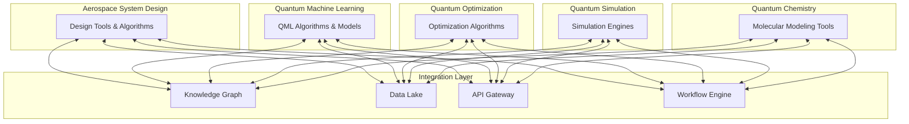

# GAIA-QAO Application Layers

**Aerospace System Design**: Applications for [aircraft and spacecraft design](https://github.com/Gaia-Q-High-Performance-Computing/application-layers/blob/main/README.md)  
**Quantum Machine Learning**: [QML algorithms](https://github.com/Gaia-Q-High-Performance-Computing/application-layers/blob/main/README.md) for aerospace applications  
**Quantum Optimization**: [Optimization algorithms](https://github.com/Gaia-Q-High-Performance-Computing/application-layers/blob/main/README.md) for aerospace problems  
**Quantum Simulation**: [Simulation of physical systems and materials](https://github.com/Gaia-Q-High-Performance-Computing/application-layers/blob/main/README.md)  
**Quantum Chemistry**: [Molecular modeling](https://github.com/Gaia-Q-High-Performance-Computing/application-layers/blob/main/README.md) for new aerospace materials
**Quantum Machine Intelligence**: [QMI](https://github.com/Gaia-Q-High-Performance-Computing/application-layers/blob/main/docs/architecture/overview.md) for intelligent aerospace systems

> **DISCLAIMER: GenAI Proposal Status**  
> This document was generated with AI assistance and represents a proposed overview of quantum computing application layers within GAIA Quantum Aerospace Organization (GAIA-QAO). The content is subject to review, modification, and approval by authorized stakeholders.

## Overview

This repository contains the core application layers that power GAIA-QAO's quantum-enhanced aerospace computing platform. These layers provide a comprehensive framework for leveraging quantum computing across various aerospace domains, enabling unprecedented capabilities in design, simulation, optimization, and materials development.

The application layers are designed to work both independently and as an integrated system, with standardized interfaces that enable seamless data exchange and workflow integration. Each layer is optimized for specific aerospace applications while maintaining compatibility with the overall GAIA-QAO technology stack.

### Aerospace System Design

The Aerospace System Design layer provides quantum-enhanced tools and algorithms for aircraft and spacecraft design processes. This layer enables engineers to explore vast design spaces, optimize complex multi-parameter systems, and validate designs with unprecedented accuracy.

**Key Components:**
- Quantum Design Optimization Framework
- Quantum-Enhanced CAD Integration
- Quantum Digital Twin Platform
- Multi-objective Aerospace Optimization Suite
- Quantum-Classical Design Verification Tools

**Use Cases:**
- Aircraft aerodynamics optimization
- Spacecraft configuration design
- Propulsion system design and analysis
- Structural design and optimization
- Systems integration and validation

**Integration Points:**
- Feeds optimized designs to Quantum Simulation
- Receives material properties from Quantum Chemistry
- Leverages algorithms from Quantum Optimization
- Utilizes models from Quantum Machine Learning

### Quantum Machine Learning

The Quantum Machine Learning layer implements QML algorithms specifically tailored for aerospace applications. This layer enables enhanced pattern recognition, predictive capabilities, and autonomous systems that surpass classical machine learning approaches.

**Key Components:**
- Quantum Neural Network Framework
- Aerospace-Specific Quantum Feature Maps
- Hybrid Quantum-Classical ML Pipeline
- Quantum Transfer Learning System
- Quantum Reinforcement Learning Platform

**Use Cases:**
- Predictive maintenance for aerospace systems
- Autonomous flight control and navigation
- Design space exploration and surrogate modeling
- Mission planning and optimization
- Anomaly detection in complex systems

**Integration Points:**
- Provides predictive models to Aerospace System Design
- Enhances optimization processes in Quantum Optimization
- Analyzes simulation results from Quantum Simulation
- Accelerates material discovery in Quantum Chemistry

### Quantum Optimization

The Quantum Optimization layer implements specialized algorithms for solving complex optimization problems in aerospace engineering. This layer enables efficient solutions to multidimensional problems with numerous constraints that are intractable for classical approaches.

**Key Components:**
- Quantum Approximate Optimization Algorithm (QAOA) Framework
- Quantum Annealing Integration Platform
- Variational Quantum Eigensolver (VQE) Suite
- Hybrid Quantum-Classical Optimization Pipeline
- Multi-objective Aerospace Optimization Toolkit

**Use Cases:**
- Flight path optimization
- Supply chain and logistics optimization
- Resource allocation for aerospace operations
- Structural topology optimization
- Manufacturing process optimization

**Integration Points:**
- Provides optimization algorithms to Aerospace System Design
- Enhances efficiency of Quantum Simulation
- Optimizes machine learning models in Quantum Machine Learning
- Accelerates molecular optimization in Quantum Chemistry

### Quantum Simulation

The Quantum Simulation layer leverages quantum computing to model complex physical systems relevant to aerospace engineering. This layer enables high-fidelity simulations that capture quantum mechanical effects critical for advanced aerospace applications.

**Key Components:**
- Quantum Physics Simulation Engine
- Quantum Material Science Platform
- Quantum Environmental Simulation Suite
- Quantum-Classical Co-Simulation Framework
- Aerospace-Specific Simulation Libraries

**Use Cases:**
- Advanced materials simulation
- Aerodynamics and fluid dynamics simulation
- Space environment modeling
- Propulsion system simulation
- Structural dynamics simulation

**Integration Points:**
- Validates designs from Aerospace System Design
- Provides simulation data to Quantum Machine Learning
- Utilizes optimization from Quantum Optimization
- Verifies molecular models from Quantum Chemistry

### Quantum Chemistry

The Quantum Chemistry layer implements quantum algorithms for molecular modeling and materials design. This layer enables the development of new materials with properties specifically tailored for aerospace applications.

**Key Components:**
- Electronic Structure Calculation Framework
- Quantum Reaction Dynamics Platform
- Material Property Prediction Suite
- Quantum-Enhanced Molecular Design Toolkit
- Aerospace Materials Database

**Use Cases:**
- Advanced aerospace materials development
- Propulsion chemistry optimization
- Protective coatings design
- Energy storage materials research
- Environmental interaction modeling

**Integration Points:**
- Provides material properties to Aerospace System Design
- Feeds molecular data to Quantum Simulation
- Utilizes optimization from Quantum Optimization
- Leverages predictive models from Quantum Machine Learning

### Quantum Machine Intelligence

The Quantum Machine Intelligence (QMI) layer combines quantum computing, machine learning, advanced sensors, and ethical governance to enable adaptive and intelligent operation of quantum-semantic aerospace systems.

**Key Components:**
- Hybrid Classical-Quantum Algorithms
- Quantum Learning: Quantum Kernels, QAOA, Variational Circuits
- Multimodal Processing: Textual, Sensor, IoT, Quantum Telemetry Data
- CO2-aware Optimization: Minimization of emissions in sustainable HPC centers

**Use Cases:**
- Sustainable Materials: Quantum simulation for ecological design
- Aerospace Traffic: Optimal routes and predictive management
- Cybersecurity: Anomaly detection with quantum big data
- Predictive Maintenance: Real-time telemetry processing
- Creative Design: Quantum solvers for complex aerospace problems

**Integration Points:**
- Compatible with `AGAD`, `AMEDEO`, `UXT-Q`, `GAIA-Q-Hub.it`, `GA-SToP-CO2`, `Q-ASIN-Q`

## Integration Framework

The application layers are integrated through a comprehensive framework that enables seamless collaboration and data exchange:



## Getting Started

### Prerequisites

- Access to GAIA-QAO quantum computing resources
- Python 3.9+ with quantum computing libraries
- GAIA-QAO Quantum-Classical Bridge installed
- Appropriate security clearance for aerospace applications


### Installation

```shellscript
# Clone the repository
git clone https://github.com/Gaia-Q-High-Performance-Computing/application-layers.git

# Navigate to the repository directory
cd application-layers

# Install dependencies
pip install -r requirements.txt

# Configure quantum resources
python setup_quantum_resources.py

# Verify installation
python verify_installation.py
```

### Basic Usage

Each application layer can be used independently or as part of an integrated workflow:

```python
# Import the required application layers
from gaia_qao.aerospace_design import QuantumDesignOptimizer
from gaia_qao.qml import QuantumNeuralNetwork
from gaia_qao.optimization import QAOA
from gaia_qao.simulation import QuantumSimulationEngine
from gaia_qao.chemistry import ElectronicStructureCalculator

# Initialize the components
design_optimizer = QuantumDesignOptimizer()
neural_network = QuantumNeuralNetwork()
optimizer = QAOA()
simulation_engine = QuantumSimulationEngine()
chemistry_calculator = ElectronicStructureCalculator()

# Create an integrated workflow
from gaia_qao.integration import WorkflowEngine

workflow = WorkflowEngine()
workflow.add_step("material_design", chemistry_calculator.optimize_material)
workflow.add_step("property_simulation", simulation_engine.simulate_properties)
workflow.add_step("design_optimization", design_optimizer.optimize_design)
workflow.add_step("performance_prediction", neural_network.predict_performance)

# Execute the workflow
results = workflow.execute(input_parameters)
```

## Documentation

Detailed documentation for each application layer is available in the respective directories:

- [Aerospace System Design](./aerospace_design/README.md)
- [Quantum Machine Learning](./qml/README.md)
- [Quantum Optimization](./optimization/README.md)
- [Quantum Simulation](./simulation/README.md)
- [Quantum Chemistry](./chemistry/README.md)
- [Quantum Machine Intelligence](./docs/architecture/overview.md)


API documentation is available at [https://docs.gaia-qao.org/application-layers](https://docs.gaia-qao.org/application-layers).

## Development Roadmap

### Phase 1: Foundation (Current)

- Implementation of core algorithms for each application layer
- Basic integration between layers
- Compatibility with NISQ-era quantum devices
- Quantum-classical hybrid approaches


### Phase 2: Enhancement (Next 12 Months)

- Advanced error mitigation techniques
- Expanded algorithm libraries
- Deeper integration between layers
- Performance optimization for specific aerospace use cases


### Phase 3: Maturation (12-36 Months)

- Fault-tolerant quantum algorithm implementations
- Full production readiness
- Comprehensive aerospace application coverage
- Advanced visualization and interaction tools


## Contributing

We welcome contributions from the GAIA-QAO community. Please see [CONTRIBUTING.md](./CONTRIBUTING.md) for guidelines on how to contribute to this project.

### Development Setup

```shellscript
# Create a development environment
python -m venv venv
source venv/bin/activate  # On Windows: venv\Scripts\activate

# Install development dependencies
pip install -r requirements-dev.txt

# Run tests
pytest

# Check code style
flake8
```

## License

This project is licensed under the GAIA-QAO Proprietary License - see the [LICENSE](./LICENSE) file for details.

## Acknowledgments

- GAIA-QAO Quantum Computing Research Team
- Aerospace Industry Partners
- Quantum Hardware Providers
- Academic Research Collaborators


## Contact

For questions or support, please contact the GAIA-QAO High Performance Computing team at [quantum@gaia-qao.org](mailto:quantum@gaia-qao.org).


## Quantum Verification Documentation Structure Implementation

### Overview

The Quantum Verification Documentation Structure provides a comprehensive framework for documenting the verification processes of quantum algorithms used in the Ampel360 BWB Q100 aircraft. This structure ensures consistency, traceability, and compliance with aerospace standards.

### Documentation Files

- [Documentation Architecture Overview](./docs/architecture/overview.md)
- [Master Verification Plan Template](./docs/templates/master-verification-plan.md)
- [Verification Framework Template](./docs/templates/verification-framework.md)
- [Standards Compliance Matrix Template](./docs/templates/standards-compliance-matrix.md)
- [Tool Qualification Plan Template](./docs/templates/tool-qualification-plan.md)
- [Algorithm Case Study Template](./docs/templates/algorithm-case-study.md)
- [Verification Report Template](./docs/templates/verification-report.md)
- [Document Creation Process Guide](./docs/templates/document-creation-process.md)
- [Metadata Standards Guide](./docs/templates/metadata-standards.md)
- [Document Relationships and Traceability Guide](./docs/templates/document-relationships.md)
- [Implementation Roadmap](./docs/templates/implementation-roadmap.md)
- [Document Management System Guide](./docs/templates/document-management-system.md)

### Aerospace System Design Layer Documentation

The Aerospace System Design Layer Documentation provides comprehensive documentation for the Aerospace System Design application layer. It includes detailed descriptions of the architecture, components, and processes involved in the design and optimization of aerospace systems using quantum computing.

### Quantum Machine Learning Layer Documentation

The Quantum Machine Learning Layer Documentation provides comprehensive documentation for the Quantum Machine Learning application layer. It includes detailed descriptions of the algorithms, models, and processes involved in applying quantum machine learning to aerospace applications.

### Quantum Optimization Layer Documentation

The Quantum Optimization Layer Documentation provides comprehensive documentation for the Quantum Optimization application layer. It includes detailed descriptions of the algorithms, techniques, and processes involved in optimizing aerospace systems using quantum computing.

### Quantum Simulation Layer Documentation

The Quantum Simulation Layer Documentation provides comprehensive documentation for the Quantum Simulation application layer. It includes detailed descriptions of the simulation engines, models, and processes involved in simulating aerospace systems using quantum computing.

### Quantum Chemistry Layer Documentation

The Quantum Chemistry Layer Documentation provides comprehensive documentation for the Quantum Chemistry application layer. It includes detailed descriptions of the molecular modeling tools, algorithms, and processes involved in developing new aerospace materials using quantum computing.

  <Actions>
  <Action name="Create detailed documentation for Aerospace System Design layer" description="Develop comprehensive documentation for the Aerospace System Design application layer" />
  <Action name="Create detailed documentation for Quantum Machine Learning layer" description="Develop comprehensive documentation for the QML application layer" />
  <Action name="Create detailed documentation for Quantum Optimization layer" description="Develop comprehensive documentation for the Quantum Optimization application layer" />
  <Action name="Create detailed documentation for Quantum Simulation layer" description="Develop comprehensive documentation for the Quantum Simulation application layer" />
  <Action name="Create detailed documentation for Quantum Chemistry layer" description="Develop comprehensive documentation for the Quantum Chemistry application layer" />
</Actions>

## GAIA-QAO CFD Automation Script

### Description

The GAIA-QAO CFD Automation Script is designed to automate the Computational Fluid Dynamics (CFD) workflow using OpenFOAM. It includes validation, error handling, and scalability features to ensure robust and efficient simulations.

### Features

- **Automatic Validation**: Checks system requirements and case structure before execution
- **Error Handling**: Robust error detection and management with detailed logs
- **Scalability**: Supports parallel execution with automatic core detection
- **Traceability**: Comprehensive logging system with timestamps and performance metrics
- **Backup**: Automatically backs up previous results before new runs
- **Reporting**: Generates executive summary reports post-simulation

### Requirements

#### Software

- OpenFOAM v7/v8/v9 or ESI-OpenFOAM v2006+
- MPI (OpenMPI or MPICH)
- Python 3.6+ (for additional post-processing scripts)

#### Case Structure

```
case_CFD/
├── 0/                  # Initial conditions
├── constant/           # Physical properties and mesh
│   ├── triSurface/    # STL geometries (optional)
│   └── polyMesh/      # Mesh (generated by blockMesh)
├── system/            # Solver configuration
│   ├── controlDict
│   ├── fvSchemes
│   ├── fvSolution
│   ├── decomposeParDict
│   └── snappyHexMeshDict (optional)
└── runCFD.sh          # Automation script
```

### Installation

1. **Download the script**:
```bash
wget https://raw.githubusercontent.com/your-repo/runCFD.sh
# or
curl -O https://raw.githubusercontent.com/your-repo/runCFD.sh
```

2. **Make it executable**:
```bash
chmod +x runCFD.sh
```

3. **Verify OpenFOAM**:
```bash
# For OpenFOAM Foundation
source /opt/openfoam9/etc/bashrc

# For ESI-OpenFOAM
source /usr/lib/openfoam/openfoam2106/etc/bashrc
```

### Usage

#### Basic Execution
```bash
# With default cores (4)
./runCFD.sh

# With specific number of cores
./runCFD.sh 8

# View help
./runCFD.sh --help
```

#### Workflow

1. **blockMesh**: Generates base hexahedral mesh
2. **surfaceFeatureExtract**: Extracts features from STL geometries
3. **snappyHexMesh**: Refines mesh around complex geometries
4. **decomposePar**: Divides domain for parallel computation
5. **checkMesh**: Validates mesh quality
6. **simpleFoam**: Runs steady-state RANS solver
7. **reconstructPar**: Recombines parallel results
8. **postProcess**: Calculates forces, Cp, y+, etc.

### Validation Metrics

#### Mesh Quality
The script automatically validates:
- **Aspect Ratio**: < 100 (ideal < 20)
- **Non-orthogonality**: < 70° (ideal < 40°)
- **Skewness**: < 4 (ideal < 2)
- **Volume Ratio**: < 100 (ideal < 10)

#### Convergence
Monitors:
- Continuity residuals: < 1e-3
- Velocity residuals: < 1e-4
- Turbulence residuals: < 1e-4

### Output Structure

```
case_CFD/
├── logs/                          # Detailed logs
│   ├── blockMesh_20240115_143022.log
│   ├── checkMesh_20240115_143025.log
│   ├── simpleFoam_20240115_143030.log
│   └── cfd_run_report_20240115_143022.txt
├── postProcessing/               # Post-processed results
│   ├── forces/
│   ├── wallShearStress/
│   └── yPlus/
└── [timeDirectories]/           # Solution fields
```

### Real-Time Monitoring

#### During Execution
```bash
# View solver progress
tail -f logs/simpleFoam_*.log

# Monitor residuals
foamMonitor -l postProcessing/residuals/0/residuals.dat
```

#### Post-Processing
```bash
# Visualize in ParaView
paraFoam -builtin

# Extract aerodynamic coefficients
foamCalc mag U
postProcess -func 'forceCoeffs'
```

### Customization

#### Change Default Number of Cores
Edit line in `runCFD.sh`:
```bash
readonly DEFAULT_CORES=8  # Change from 4 to 8
```

#### Add Post-Processing Functions
Add in `system/controlDict`:
```c
functions
{
    forceCoeffs
    {
        type            forceCoeffs;
        libs            ("libforces.so");
        writeControl    timeStep;
        writeInterval   1;
        
        patches         (wall);
        rho             rhoInf;
        rhoInf          1.225;
        liftDir         (0 0 1);
        dragDir         (1 0 0);
        CofR            (0 0 0);
        pitchAxis       (0 1 0);
        magUInf         10;
        lRef            1;
        Aref            1;
    }
}
```

### Troubleshooting

#### Error: "Mesh quality issues detected"
```bash
# Review specific metrics
checkMesh -allGeometry -allTopology > mesh_detailed.log

# Adjust parameters in snappyHexMeshDict
# - Reduce refinementLevel
# - Adjust nSmoothPatch
```

#### Error: "Final residual too high"
```bash
# Review numerical schemes in fvSchemes
# Temporarily switch from second order to first order
# Adjust relaxation factors in fvSolution
```

#### Error: "MPI initialization failed"
```bash
# Verify MPI installation
mpirun --version

# Try with fewer cores
./runCFD.sh 2
```

### Scalability Data

Based on tests with typical GAIA-QAO geometries:

| Cores | Cells | Time (min) | Efficiency |
|-------|-------|------------|------------|
| 1     | 1M    | 120        | 100%       |
| 4     | 1M    | 35         | 86%        |
| 8     | 1M    | 20         | 75%        |
| 16    | 1M    | 12         | 62%        |
| 4     | 5M    | 180        | 89%        |
| 8     | 5M    | 95         | 84%        |
| 16    | 5M    | 55         | 77%        |

### Best Practices

1. **Always review logs**: Especially `checkMesh` before proceeding
2. **Regular backups**: Script does this automatically, but consider external backups
3. **Result validation**: Compare with experimental data when possible
4. **Version control**: Use Git to track configuration changes
5. **Document changes**: Maintain a changelog of significant modifications

### References

- [OpenFOAM User Guide](https://www.openfoam.com/documentation/user-guide)
- [CFD Direct: Best Practices](https://cfd.direct/openfoam/user-guide/)
- [GAIA-QAO Project Documentation](internal-link)

### Contributions

To report issues or suggest improvements:
1. Create an issue in the repository
2. Include relevant logs
3. Describe steps to reproduce

### License

This project is under the MIT license. See `LICENSE` for details.

---


