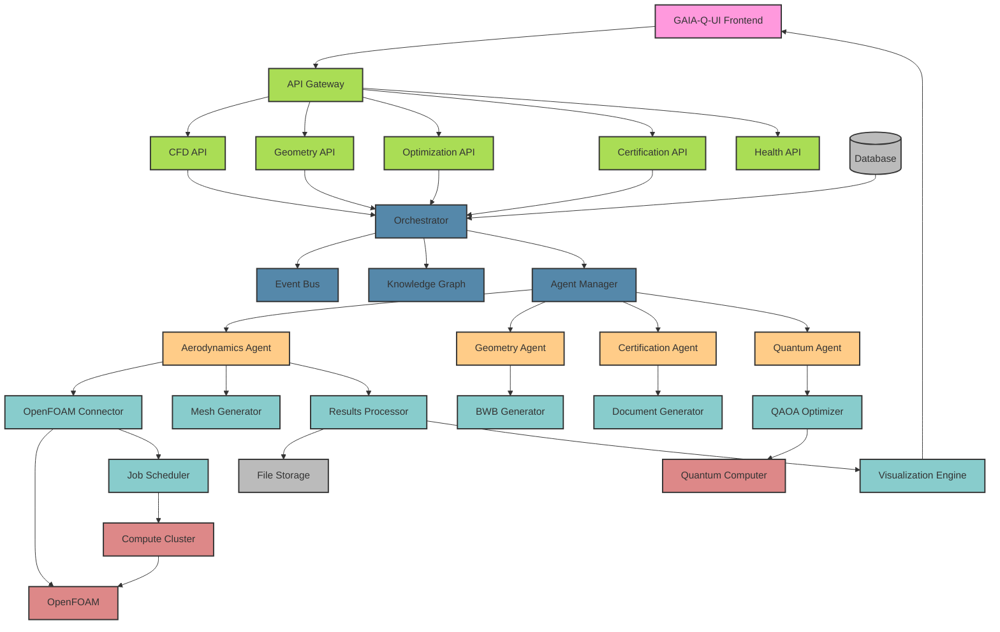
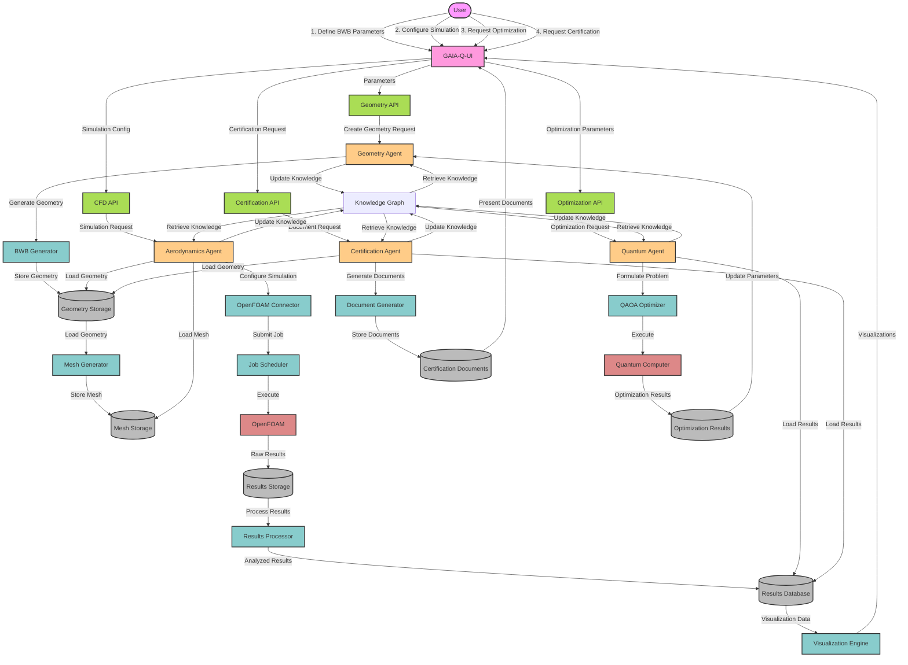

### GAIA-Q-AI Project Directory Structure

**GenAI Proposal Status: This directory structure is generated by AI for the GAIA-Q-AI project with OpenFOAM integration and should be reviewed by software architects and aerospace engineers before implementation.**

```plaintext
gaia-q-ai/
├── README.md
├── CONTRIBUTING.md
├── LICENSE
├── package.json
├── tsconfig.json
├── pyproject.toml
├── requirements.txt
├── .env.example
├── .gitignore
├── docker-compose.yml
├── Dockerfile
├── next.config.js
├── tailwind.config.js
│
├── src/
│   ├── app/                                # Next.js App Router
│   │   ├── layout.tsx
│   │   ├── page.tsx
│   │   ├── globals.css
│   │   ├── api/
│   │   │   ├── cfd/
│   │   │   │   ├── route.ts
│   │   │   │   ├── [jobId]/
│   │   │   │   │   ├── route.ts
│   │   │   │   │   ├── status/
│   │   │   │   │   │   └── route.ts
│   │   │   │   │   └── results/
│   │   │   │   │       └── route.ts
│   │   │   ├── geometry/
│   │   │   │   ├── route.ts
│   │   │   │   └── [geometryId]/
│   │   │   │       └── route.ts
│   │   │   ├── optimization/
│   │   │   │   └── route.ts
│   │   │   ├── certification/
│   │   │   │   └── route.ts
│   │   │   └── health/
│   │   │       └── route.ts
│   │   ├── dashboard/
│   │   │   └── page.tsx
│   │   ├── simulations/
│   │   │   ├── page.tsx
│   │   │   └── [simulationId]/
│   │   │       ├── page.tsx
│   │   │       └── results/
│   │   │           └── page.tsx
│   │   ├── geometry/
│   │   │   ├── page.tsx
│   │   │   └── [geometryId]/
│   │   │       └── page.tsx
│   │   ├── optimization/
│   │   │   └── page.tsx
│   │   └── certification/
│   │       └── page.tsx
│   │
│   ├── components/                         # React Components
│   │   ├── ui/                             # UI Components (shadcn)
│   │   │   ├── button.tsx
│   │   │   ├── card.tsx
│   │   │   ├── dialog.tsx
│   │   │   └── ... (other UI components)
│   │   ├── layout/                         # Layout Components
│   │   │   ├── header.tsx
│   │   │   ├── sidebar.tsx
│   │   │   ├── footer.tsx
│   │   │   └── main-layout.tsx
│   │   ├── cfd/                            # CFD-specific Components
│   │   │   ├── cfd-simulation-config.tsx
│   │   │   ├── cfd-simulation-results.tsx
│   │   │   ├── cfd-job-status.tsx
│   │   │   └── cfd-parameter-form.tsx
│   │   ├── geometry/                       # Geometry Components
│   │   │   ├── bwb-geometry-form.tsx
│   │   │   ├── geometry-viewer.tsx
│   │   │   └── parameter-slider.tsx
│   │   ├── visualization/                  # Visualization Components
│   │   │   ├── 3d-viewer.tsx
│   │   │   ├── pressure-distribution.tsx
│   │   │   ├── streamlines-viewer.tsx
│   │   │   ├── color-legend.tsx
│   │   │   └── chart-container.tsx
│   │   ├── optimization/                   # Optimization Components
│   │   │   ├── optimization-form.tsx
│   │   │   ├── optimization-results.tsx
│   │   │   └── pareto-front-viewer.tsx
│   │   └── certification/                  # Certification Components
│   │       ├── compliance-matrix.tsx
│   │       ├── requirement-tracker.tsx
│   │       └── document-viewer.tsx
│   │
│   ├── lib/                                # Shared Frontend Utilities
│   │   ├── utils.ts
│   │   ├── hooks/
│   │   │   ├── use-cfd-simulation.ts
│   │   │   ├── use-geometry.ts
│   │   │   ├── use-optimization.ts
│   │   │   └── use-certification.ts
│   │   ├── types/
│   │   │   ├── cfd-types.ts
│   │   │   ├── geometry-types.ts
│   │   │   ├── optimization-types.ts
│   │   │   └── certification-types.ts
│   │   └── api/
│   │       ├── cfd-api.ts
│   │       ├── geometry-api.ts
│   │       ├── optimization-api.ts
│   │       └── certification-api.ts
│   │
│   ├── core/                               # Core Backend System
│   │   ├── __init__.py
│   │   ├── config.py
│   │   ├── logging.py
│   │   ├── exceptions.py
│   │   ├── mcp/                            # Main Control Program
│   │   │   ├── __init__.py
│   │   │   ├── orchestrator.py
│   │   │   ├── event_bus.py
│   │   │   ├── knowledge_graph.py
│   │   │   └── agent_manager.py
│   │   └── database/
│   │       ├── __init__.py
│   │       ├── models.py
│   │       ├── repositories.py
│   │       └── migrations/
│   │           └── ... (migration files)
│   │
│   ├── agents/                             # Agent System
│   │   ├── __init__.py
│   │   ├── base/
│   │   │   ├── __init__.py
│   │   │   └── base_agent.py
│   │   ├── aerodynamics/
│   │   │   ├── __init__.py
│   │   │   ├── aerodynamics_agent.py
│   │   │   ├── cfd_module.py
│   │   │   ├── analysis_module.py
│   │   │   └── optimization_module.py
│   │   ├── geometry/
│   │   │   ├── __init__.py
│   │   │   ├── geometry_agent.py
│   │   │   └── bwb_generator.py
│   │   ├── certification/
│   │   │   ├── __init__.py
│   │   │   ├── certification_agent.py
│   │   │   └── document_generator.py
│   │   └── quantum/
│   │       ├── __init__.py
│   │       ├── quantum_agent.py
│   │       └── qaoa_optimizer.py
│   │
│   ├── services/                           # Backend Services
│   │   ├── __init__.py
│   │   ├── openfoam/
│   │   │   ├── __init__.py
│   │   │   ├── openfoam_connector.py
│   │   │   ├── case_manager.py
│   │   │   ├── mesh_generator.py
│   │   │   └── results_processor.py
│   │   ├── job/
│   │   │   ├── __init__.py
│   │   │   ├── job_scheduler.py
│   │   │   └── job_monitor.py
│   │   ├── visualization/
│   │   │   ├── __init__.py
│   │   │   ├── visualization_processor.py
│   │   │   └── data_converter.py
│   │   ├── certification/
│   │   │   ├── __init__.py
│   │   │   ├── certification_reporter.py
│   │   │   └── compliance_checker.py
│   │   └── quantum/
│   │       ├── __init__.py
│   │       ├── quantum_connector.py
│   │       └── qaoa_service.py
│   │
│   ├── utils/                              # Shared Backend Utilities
│   │   ├── __init__.py
│   │   ├── file_utils.py
│   │   ├── math_utils.py
│   │   ├── validation.py
│   │   └── serialization.py
│   │
│   └── schemas/                            # Data Schemas
│       ├── __init__.py
│       ├── cfd_schemas.py
│       ├── geometry_schemas.py
│       ├── optimization_schemas.py
│       └── certification_schemas.py
│
├── config/                                 # Configuration Files
│   ├── default.yaml
│   ├── development.yaml
│   ├── production.yaml
│   ├── test.yaml
│   ├── openfoam/
│   │   ├── system/
│   │   │   ├── controlDict.template
│   │   │   ├── fvSchemes.template
│   │   │   └── fvSolution.template
│   │   └── constant/
│   │       ├── transportProperties.template
│   │       └── turbulenceProperties.template
│   └── quantum/
│       └── qaoa_config.yaml
│
├── templates/                              # Document Templates
│   ├── certification/
│   │   ├── easa/
│   │   │   ├── compliance_matrix.html
│   │   │   ├── test_report.html
│   │   │   └── validation_report.html
│   │   └── faa/
│   │       └── compliance_report.html
│   └── reports/
│       ├── simulation_report.html
│       └── optimization_report.html
│
├── public/                                 # Static Assets
│   ├── images/
│   │   ├── logo.svg
│   │   └── aircraft/
│   │       └── bwb_concept.png
│   ├── fonts/
│   │   └── ... (font files)
│   └── models/
│       └── bwb_baseline.stl
│
├── data/                                   # Data Storage
│   ├── geometries/                         # Geometry Files
│   │   └── ... (geometry files)
│   ├── simulations/                        # Simulation Data
│   │   └── ... (simulation files)
│   ├── results/                            # Processed Results
│   │   └── ... (result files)
│   └── certification/                      # Certification Documents
│       └── ... (certification files)
│
├── scripts/                                # Utility Scripts
│   ├── setup_environment.sh
│   ├── install_openfoam.sh
│   ├── generate_test_data.py
│   └── database_migration.py
│
├── tests/                                  # Test Suite
│   ├── unit/
│   │   ├── core/
│   │   │   └── ... (core unit tests)
│   │   ├── agents/
│   │   │   └── ... (agent unit tests)
│   │   ├── services/
│   │   │   └── ... (service unit tests)
│   │   └── utils/
│   │       └── ... (utility unit tests)
│   ├── integration/
│   │   ├── openfoam/
│   │   │   └── ... (OpenFOAM integration tests)
│   │   ├── quantum/
│   │   │   └── ... (quantum integration tests)
│   │   └── api/
│   │       └── ... (API integration tests)
│   ├── e2e/
│   │   ├── simulation_workflow.test.ts
│   │   ├── optimization_workflow.test.ts
│   │   └── certification_workflow.test.ts
│   └── fixtures/
│       ├── geometries/
│       │   └── test_bwb.stl
│       ├── simulations/
│       │   └── test_case/
│       │       └── ... (test case files)
│       └── results/
│           └── test_results.json
│
├── docs/                                   # Documentation
│   ├── architecture/
│   │   ├── overview.md
│   │   ├── components.md
│   │   └── data_flow.md
│   ├── api/
│   │   ├── openfoam_api.md
│   │   ├── geometry_api.md
│   │   ├── optimization_api.md
│   │   └── certification_api.md
│   ├── user/
│   │   ├── getting_started.md
│   │   ├── simulation_guide.md
│   │   ├── optimization_guide.md
│   │   └── certification_guide.md
│   ├── developer/
│   │   ├── setup.md
│   │   ├── coding_standards.md
│   │   ├── testing.md
│   │   └── contributing.md
│   ├── compliance/
│   │   ├── easa_requirements.md
│   │   ├── do-178c_checklist.md
│   │   └── traceability_matrix.md
│   └── images/
│       └── ... (documentation images)
│
└── kubernetes/                             # Kubernetes Deployment
    ├── base/
    │   ├── deployment.yaml
    │   ├── service.yaml
    │   ├── ingress.yaml
    │   └── configmap.yaml
    ├── overlays/
    │   ├── development/
    │   │   ├── kustomization.yaml
    │   │   └── configmap.yaml
    │   └── production/
    │       ├── kustomization.yaml
    │       └── configmap.yaml
    └── volumes/
        ├── openfoam-data-pvc.yaml
        └── results-pvc.yaml
```

## Key Directory Structure Highlights

### 1. Frontend Structure (`src/app`, `src/components`, `src/lib`)

- **Next.js App Router**: Organized by feature (simulations, geometry, optimization, certification)
- **Component Organization**: Separated by domain and functionality
- **Shared Frontend Utilities**: Hooks, types, and API clients


### 2. Backend Structure (`src/core`, `src/agents`, `src/services`, `src/utils`)

- **Core System**: Central orchestration and control
- **Agent System**: Domain-specific intelligent agents
- **Services**: Specialized functionality providers
- **Utilities**: Shared helper functions


### 3. OpenFOAM Integration

- **OpenFOAM Connector**: `src/services/openfoam/openfoam_connector.py`
- **Case Manager**: `src/services/openfoam/case_manager.py`
- **Mesh Generator**: `src/services/openfoam/mesh_generator.py`
- **Results Processor**: `src/services/openfoam/results_processor.py`
- **Configuration Templates**: `config/openfoam/`


### 4. Geometry Parameterization

- **BWB Generator**: `src/agents/geometry/bwb_generator.py`
- **Geometry Agent**: `src/agents/geometry/geometry_agent.py`
- **Geometry UI Components**: `src/components/geometry/`


### 5. Visualization Engine

- **Visualization Processor**: `src/services/visualization/visualization_processor.py`
- **Data Converter**: `src/services/visualization/data_converter.py`
- **Visualization Components**: `src/components/visualization/`


### 6. Certification Reporting

- **Certification Agent**: `src/agents/certification/certification_agent.py`
- **Document Generator**: `src/agents/certification/document_generator.py`
- **Certification Reporter**: `src/services/certification/certification_reporter.py`
- **Compliance Checker**: `src/services/certification/compliance_checker.py`
- **Document Templates**: `templates/certification/`


### 7. Quantum Integration (QAOA)

- **Quantum Agent**: `src/agents/quantum/quantum_agent.py`
- **QAOA Optimizer**: `src/agents/quantum/qaoa_optimizer.py`
- **Quantum Connector**: `src/services/quantum/quantum_connector.py`
- **QAOA Service**: `src/services/quantum/qaoa_service.py`


### 8. Data Storage

- **Geometries**: `data/geometries/`
- **Simulations**: `data/simulations/`
- **Results**: `data/results/`
- **Certification Documents**: `data/certification/`


### 9. Testing Framework

- **Unit Tests**: `tests/unit/`
- **Integration Tests**: `tests/integration/`
- **End-to-End Tests**: `tests/e2e/`
- **Test Fixtures**: `tests/fixtures/`


### 10. Documentation

- **Architecture Documentation**: `docs/architecture/`
- **API Documentation**: `docs/api/`
- **User Documentation**: `docs/user/`
- **Developer Documentation**: `docs/developer/`
- **Compliance Documentation**: `docs/compliance/`


## Implementation Notes

1. **Containerization**: Docker and Kubernetes configurations for deployment
2. **Configuration Management**: YAML-based configuration with environment-specific overrides
3. **Database**: Models and repositories for persistent storage
4. **API Design**: RESTful API endpoints for all major functionalities
5. **Testing Strategy**: Comprehensive test suite with unit, integration, and E2E tests
6. **Documentation**: Thorough documentation for users, developers, and compliance

### Component Diagram for GAIA-Q-AI System

**GenAI Proposal Status: This component diagram is generated by AI for the GAIA-Q-AI system architecture and should be reviewed by software architects and aerospace engineers before implementation.**

I see you've incorporated the directory structure into your Gaia-Q-High-Performance-Computing repository. Based on this implementation, let me create a detailed component diagram that visualizes how these different parts of the system interact with each other.

## System Architecture Overview



## Component Descriptions

### Frontend Layer

- **GAIA-Q-UI Frontend**: The user interface built with Next.js that provides access to all system functionality

- Located in: `src/app/`, `src/components/`




### API Layer

- **API Gateway**: Central entry point for all API requests

- Located in: `src/app/api/`


- **CFD API**: Handles CFD simulation requests

- Located in: `src/app/api/cfd/`


- **Geometry API**: Manages aircraft geometry operations

- Located in: `src/app/api/geometry/`


- **Optimization API**: Handles optimization requests

- Located in: `src/app/api/optimization/`


- **Certification API**: Manages certification document generation

- Located in: `src/app/api/certification/`


### Core Layer

- **Orchestrator**: Central coordination system

- Located in: `src/core/mcp/orchestrator.py`


- **Event Bus**: Handles inter-component communication

- Located in: `src/core/mcp/event_bus.py`


- **Knowledge Graph**: Stores relationships between entities

- Located in: `src/core/mcp/knowledge_graph.py`


- **Agent Manager**: Manages the lifecycle of all agents

- Located in: `src/core/mcp/agent_manager.py`


### Agent Layer

- **Aerodynamics Agent**: Handles aerodynamic simulations and analysis

- Located in: `src/agents/aerodynamics/aerodynamics_agent.py`


- **Geometry Agent**: Manages aircraft geometry generation

- Located in: `src/agents/geometry/geometry_agent.py`


- **Certification Agent**: Handles certification documentation

- Located in: `src/agents/certification/certification_agent.py`


- **Quantum Agent**: Manages quantum optimization tasks

- Located in: `src/agents/quantum/quantum_agent.py`


### Service Layer

- **OpenFOAM Connector**: Interfaces with OpenFOAM

- Located in: `src/services/openfoam/openfoam_connector.py`


- **Mesh Generator**: Creates computational meshes

- Located in: `src/services/openfoam/mesh_generator.py`


- **Results Processor**: Processes simulation results

- Located in: `src/services/openfoam/results_processor.py`


- **BWB Generator**: Generates BWB aircraft geometries

- Located in: `src/agents/geometry/bwb_generator.py`


- **Document Generator**: Creates certification documents

- Located in: `src/agents/certification/document_generator.py`


- **QAOA Optimizer**: Implements quantum optimization

- Located in: `src/agents/quantum/qaoa_optimizer.py`


- **Job Scheduler**: Manages computational jobs

- Located in: `src/services/job/job_scheduler.py`


- **Visualization Engine**: Creates visualizations of results

- Located in: `src/services/visualization/visualization_processor.py`


### External Systems

- **OpenFOAM**: External CFD simulation software
- **Quantum Computer**: External quantum computing resource
- **Compute Cluster**: HPC resources for running simulations


### Storage Layer

- **Database**: Persistent storage for metadata

- Located in: `src/core/database/`


- **File Storage**: Storage for large data files

- Located in: `data/`


## Data Flow

The system follows these primary data flows:

1. **Geometry Creation Flow**:

1. User defines BWB parameters in UI
2. Geometry Agent generates 3D model
3. Model is stored in File Storage
4. Mesh Generator creates computational mesh


2. **Simulation Flow**:

1. User configures simulation in UI
2. Aerodynamics Agent prepares simulation
3. OpenFOAM Connector submits job to OpenFOAM
4. Results Processor extracts and analyzes results
5. Visualization Engine creates visualizations


3. **Optimization Flow**:

1. User defines optimization parameters
2. Quantum Agent formulates optimization problem
3. QAOA Optimizer solves using quantum resources
4. Results are applied to geometry
5. New simulation is triggered with optimized geometry


4. **Certification Flow**:

1. User requests certification document
2. Certification Agent gathers required data
3. Document Generator creates compliance documents
4. Documents are stored and presented to user


