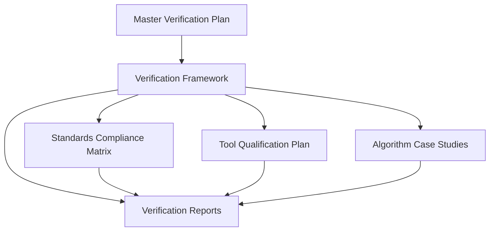

# Quantum Verification Documentation Architecture Overview

## Document Types

### Master Verification Plan (MVP)
The Master Verification Plan (MVP) establishes the overall approach, strategy, and organization for the verification of quantum algorithms used in the Ampel360 BWB Q100 aircraft. It serves as the top-level planning document for all verification activities and documentation.

### Verification Framework (VF)
The Verification Framework (VF) defines the methodologies, techniques, and processes used to verify the quantum algorithms. It provides a structured approach to ensure that the verification activities are comprehensive and consistent.

### Standards Compliance Matrix (SCM)
The Standards Compliance Matrix (SCM) maps the verification activities to the requirements of applicable aerospace standards. It serves as a reference for certification activities and demonstrates compliance with regulatory requirements.

### Tool Qualification Plan (TQP)
The Tool Qualification Plan (TQP) establishes the approach, criteria, and processes for qualifying tools used in the verification of quantum algorithms. It ensures that tools used in the verification process meet the requirements of DO-330 and support EASA certification.

### Algorithm Case Studies (ACS)
Algorithm Case Studies (ACS) provide detailed examples of the application of the Verification Framework to specific quantum algorithms. They demonstrate the practical implementation of the verification methodologies and generate verification evidence for certification.

### Verification Reports (VR)
Verification Reports (VR) document the verification activities performed on the quantum algorithms. They provide a comprehensive record of the verification process, results, and compliance status, supporting certification activities.
