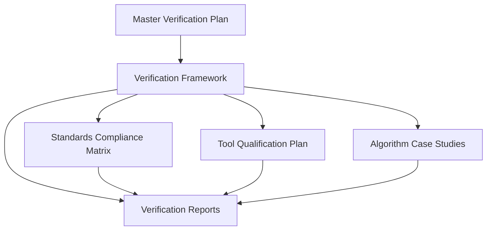

# Quantum Verification Documentation Architecture Overview

## Document Types

### Master Verification Plan (MVP)
The Master Verification Plan (MVP) establishes the overall approach, strategy, and organization for the verification of quantum algorithms used in the Ampel360 BWB Q100 aircraft. It serves as the top-level planning document for all verification activities and documentation.

### Verification Framework (VF)
The Verification Framework (VF) defines the methodologies, techniques, and processes used to verify the quantum algorithms. It provides a structured approach to ensure that the verification activities are comprehensive and consistent.

### Standards Compliance Matrix (SCM)
The Standards Compliance Matrix (SCM) maps the verification activities to the requirements of applicable aerospace standards. It serves as a reference for certification activities and demonstrates compliance with regulatory requirements.

### Tool Qualification Plan (TQP)
The Tool Qualification Plan (TQP) establishes the approach, criteria, and processes for qualifying tools used in the verification of quantum algorithms. It ensures that tools used in the verification process meet the requirements of DO-330 and support EASA certification.

### Algorithm Case Studies (ACS)
Algorithm Case Studies (ACS) provide detailed examples of the application of the Verification Framework to specific quantum algorithms. They demonstrate the practical implementation of the verification methodologies and generate verification evidence for certification.

### Verification Reports (VR)
Verification Reports (VR) document the verification activities performed on the quantum algorithms. They provide a comprehensive record of the verification process, results, and compliance status, supporting certification activities.

### Aerospace System Design Layer Documentation
The Aerospace System Design Layer Documentation provides comprehensive documentation for the Aerospace System Design application layer. It includes detailed descriptions of the architecture, components, and processes involved in the design and optimization of aerospace systems using quantum computing.

### Quantum Machine Learning Layer Documentation
The Quantum Machine Learning Layer Documentation provides comprehensive documentation for the Quantum Machine Learning application layer. It includes detailed descriptions of the algorithms, models, and processes involved in applying quantum machine learning to aerospace applications.

### Quantum Optimization Layer Documentation
The Quantum Optimization Layer Documentation provides comprehensive documentation for the Quantum Optimization application layer. It includes detailed descriptions of the algorithms, techniques, and processes involved in optimizing aerospace systems using quantum computing.

### Quantum Simulation Layer Documentation
The Quantum Simulation Layer Documentation provides comprehensive documentation for the Quantum Simulation application layer. It includes detailed descriptions of the simulation engines, models, and processes involved in simulating aerospace systems using quantum computing.

### Quantum Chemistry Layer Documentation
The Quantum Chemistry Layer Documentation provides comprehensive documentation for the Quantum Chemistry application layer. It includes detailed descriptions of the molecular modeling tools, algorithms, and processes involved in developing new aerospace materials using quantum computing.

## Quantum Verification Documentation Structure Implementation

### Overview

The Quantum Verification Documentation Structure provides a comprehensive framework for documenting the verification processes of quantum algorithms used in the Ampel360 BWB Q100 aircraft. This structure ensures consistency, traceability, and compliance with aerospace standards.

### Documentation Files

- [Documentation Architecture Overview](./docs/architecture/overview.md)
- [Master Verification Plan Template](./docs/templates/master-verification-plan.md)
- [Verification Framework Template](./docs/templates/verification-framework.md)
- [Standards Compliance Matrix Template](./docs/templates/standards-compliance-matrix.md)
- [Tool Qualification Plan Template](./docs/templates/tool-qualification-plan.md)
- [Algorithm Case Study Template](./docs/templates/algorithm-case-study.md)
- [Verification Report Template](./docs/templates/verification-report.md)
- [Document Creation Process Guide](./docs/templates/document-creation-process.md)
- [Metadata Standards Guide](./docs/templates/metadata-standards.md)
- [Document Relationships and Traceability Guide](./docs/templates/document-relationships.md)
- [Implementation Roadmap](./docs/templates/implementation-roadmap.md)
- [Document Management System Guide](./docs/templates/document-management-system.md)
